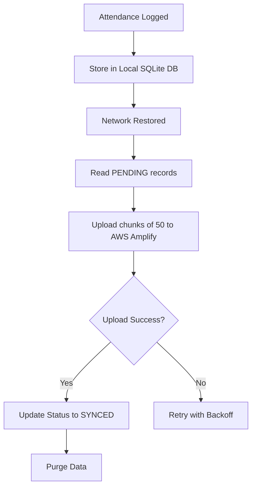

# System Architecture

## AI Pipeline Design
1. **Camera Frame** -> `react-native-vision-camera` (YUV 420, 640x480)
2. **Face Detection** -> BlazeFace (TFLite, NNAPI Accelerated). Returns Bounding Box.
3. **Alignment & Preprocessing** -> Crop using bbox, apply CLAHE to balance contrast (crucial for outdoor sunlight). Resize to 112x112.
4. **Embedding Generation** -> MobileFaceNet INT8. Returns 128-float vector.
5. **Matching** -> Cosine Similarity against local SQLite DB. Threshold > 0.6.

## Liveness Flow (Hybrid Approach)
- **Passive**: The `antispoofing.tflite` model evaluates micro-texture and depth cues from the 2D image to detect screens and printed paper.
- **Active Anti-Replay**: MediaPipe Face Mesh detects landmark movements. A randomized 4-digit token is presented requiring a sequence (e.g. BLINK_TWICE, SMILE) within 8 seconds. This prevents replay attacks.

## Offline Sync & Purge Mechanism

## Phase 2 Federated Learning Roadmap
Instead of sending raw facial photos to the cloud, FieldGuard AI supports federated learning. Devices collect anonymized gradient drifts (based on false negatives manually corrected by supervisors) and send the gradients to AWS Lambda. A FedAvg aggregator merges them and pushes the updated INT8 quantized model back to S3.
